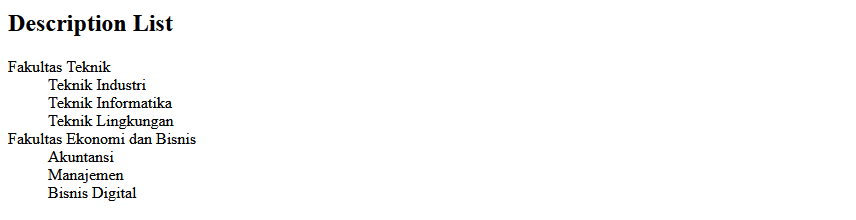
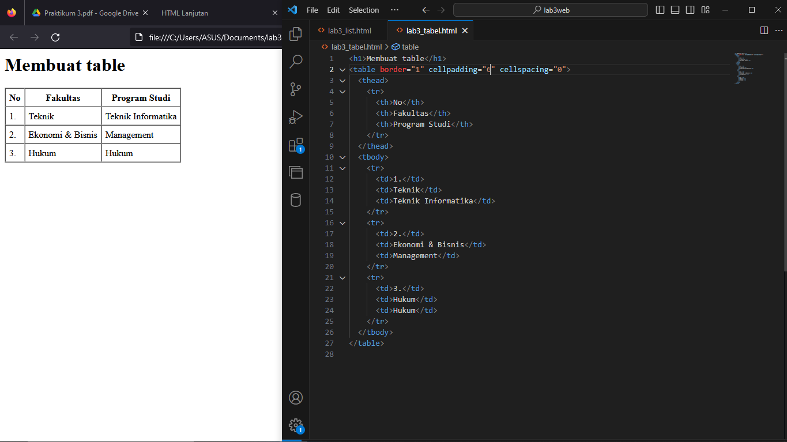
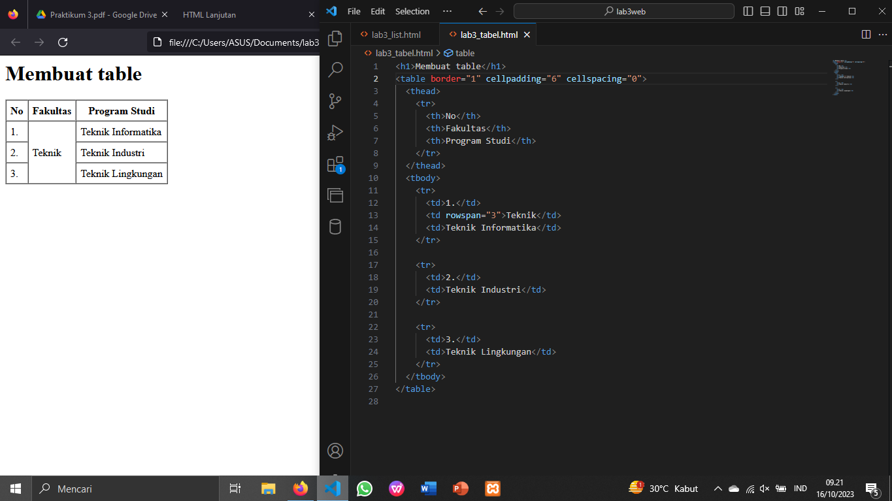
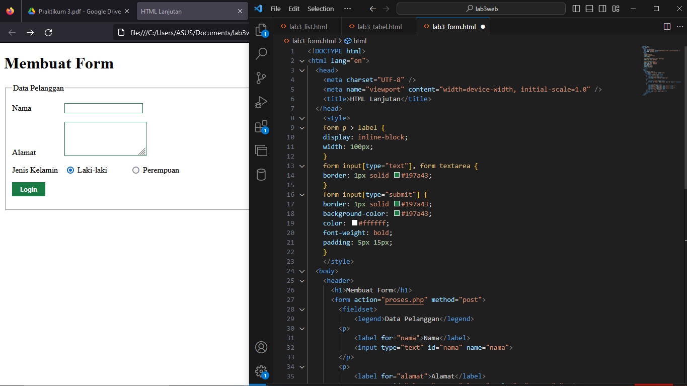
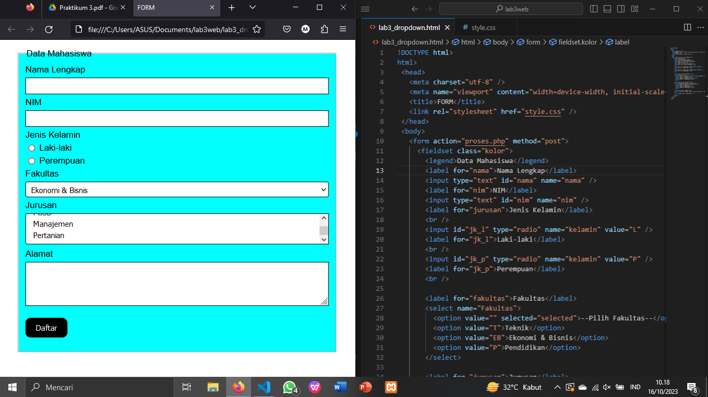

## Membuat Ordered List dan Unordered List

## Membuat Description List

## Membuat Table

## Menggabungkan Sel Data

## Membuat FORM

## PRAKTIKUM

1. Membuat form yang menampilkan dropdown menu dan listbox dengan multiple selection.

